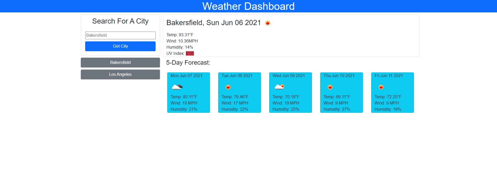

# Weather Forecaster

## Purpose

This app uses the OpenWeatherMap API to display a city's current weather and five-day forecast on the screen.

It can be used to learn weather conditions, including the UV index.

Previously searched cities are also saved to the browser for quick viewing later.

## Built with

- HTML
- CSS
- Javascript
- Bootstrap

## Website

https://quasse.github.io/forecaster/

## Screenshot

## Contribution

Made by Sam Morgen
